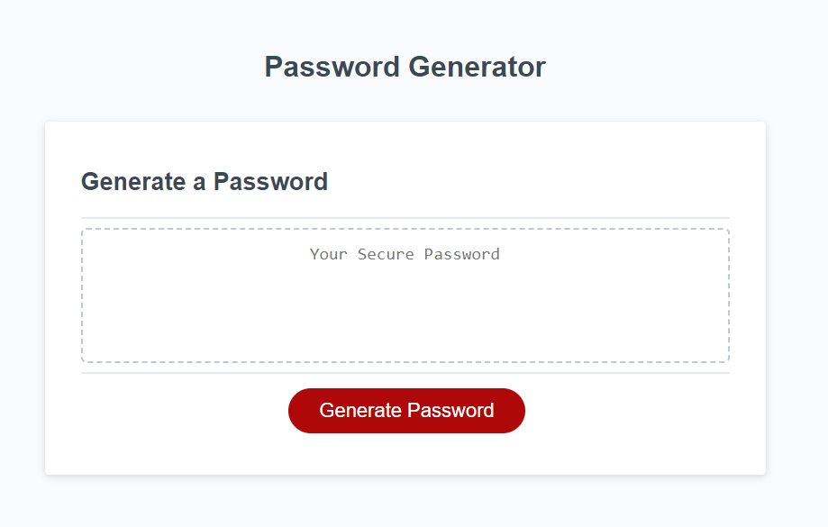

# passwordGenerator
An easy way to create a strong, random password.

## Description

Create random passwords instantly with this Password Generator!
Tailer your passwords to meet your specific requirements: length, upper and lower case letters, numbers, and special characters. 
**Completely free**: no-login required; ad-free.

## Table of Contents (Optional)

- [Installation](#installation)
- [Usage](#usage)
- [Credits](#credits)

## Installation

Free to use! No login required! Simply [click here](https://kathrynfisher3700.github.io/passwordGenerator/) to access this website.

## Usage

**Step 1**: Click "Generate Password".

**Step 2**: Type the numeric digit for the length of your password (between 8-128).

**Step 3**: Select OK to include *lowercase letters* in your password, if not click CANCEL.

**Step 4**: Select OK to include *uppercase letters* in your password, if not click CANCEL.

**Step 5**: Select OK to include *numbers* in your password, if not click CANCEL.

**Step 6**: Select OK to include *special characters* in your password, if not click CANCEL.

**Step 7**: Done! Copy your password in a secure location.

**Most Important**: website MUST be refreshed before using again (this is a work in progress; feel free to collaborate!)

## Credits

Thank you to Brandon B. & Chris. P from my UCF Coding Bootcamp, Fall 2023 class.
Parameters outlined by UCF Coding Bootcamp.

JavaScript If Else statements found here: [W3 Schools](https://www.w3schools.com/js/js_if_else.asp).

